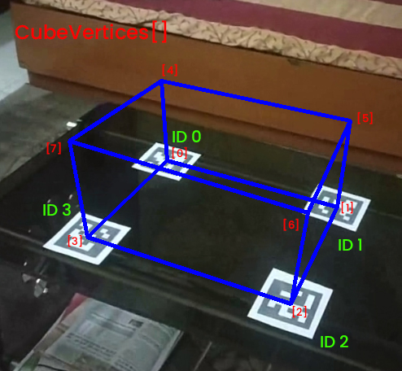
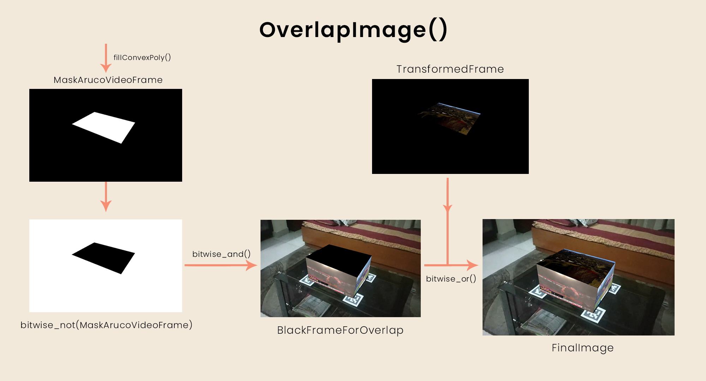

# Updated_AR_5SidedTV

This project aims to apply Augmented Reality on a simple scene with the help of Aruco Markers.

It will create a cube which will have different videos running on its 5 side(except base) simulataneously.

### Approach 

For this project, we need to generate 4 markers, print them and put them on a straight plane in the correct order(Put them making a shape of a rectangle, the marker with ID 0 must be at the top left corner of the rectangle, marker of ID 1 at the top right corner and so on).

{NOTE: The camera calibration is done with the help of python code present in "Calibrate.py" file and its intrinsic parameters are saved in a .yaml file.}

In this project, we will use Aruco Markers for an augmented reality application that builds a 3D box over a flat surface having different videos running on its all sides simultaneously. We pick a scene at home with Aruco Markers placed over a table, and we will build the Box over those markers. For this purpose, we print, cut and paste large aruco markers in the shape of a rectangle onto the table and then capture the video. We then process each frame of the video individually in order.

For each image, the markers are first detected and their pose is estimated. Now the axis coming out of the plane is taken into consideration. This axis’ top point found will be the top vertices of our 3D box and the point where all axes meet will be the bottom vertices of our 3D box. We will then feed these vertices found to a function which will overlap the video frames onto the actual video frame one by one wrt these vertices. It will hence form a 3D box as required.

Also, a condition is added everywhere in the project that if all the 4 aruco markers are not found properly or their pose is not estimated properly or the value overshoots the threshold, then false/none value is returned and further computation for that frame is broke and that frame is not considered for display. Thus the output video will stop/pause whenever any of the above conditions are satisfied.

Before overlapping the frames to form the 3D box, we have to set the cube’s vertices. It is necessary due to the following reasons:
* The value of Bottom and Top vertices found above which are stored in the variables namely BottomVertices and TopVertices respectively are of float type whereas for manipulation in the image, we need vertices coordinates to be integral.
* Currently, the vertices are unordered. That is, we don’t know which element in the variable BottomVertices and TopVertices corresponds to which Aruco marker. But it is known that the element at the same position in the variables “BottomVertices”, “TopVertices” and “IDs” correspond to the same Aruco Marker.

With this observation, we now aim to set the coordinates of the vertices of the cube in a particular order in a variable named “CubeVertices”.

The order used is that the variable “CubeVertices” will be of size 8*2 having bottom vertices of the cube in its first 4 rows and corresponding top vertices in its next 4 rows. Also, the first element will correspond to marker with ID 0, next for the marker with ID 1 and so on.
This is explained with the help of an image below.

The final step for this project is to overlap frames to form a 3D box. 

We will now call a function which will overlap the given frame onto a frame containing aruco markers wrt the given vertices of the face of the cube on which we have to overlap the frame.

Here we have to note the order in which this function should be called. First, that face should be called to overlap a frame on it which is at the back, then the side faces should be called, then the front face and finally the top face.

This order is made so that it is made sure that the back face doesn’t overlap the front face or the top face is not overlapped by any other face.

The working of function OverlapImage() is explained in the image below.

### References

Reference links are mentioned in the file Research.md.

